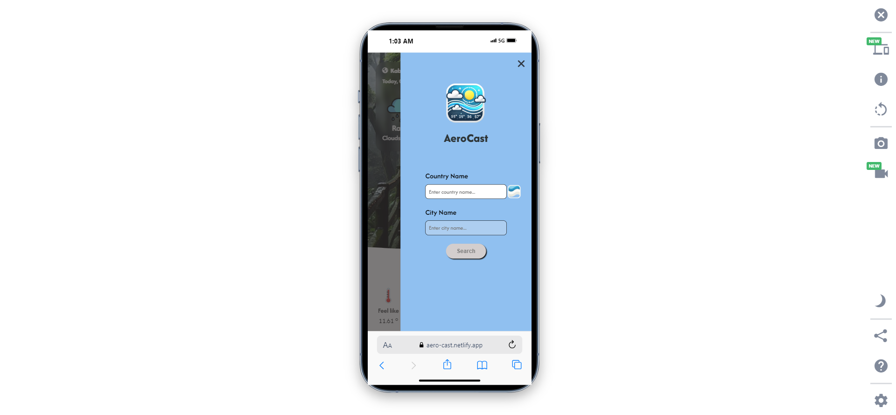

# 🌦️ AeroCast - Weather Application

[](https://app.netlify.com/sites/aero-cast/deploys)
  
  
  


## 📖 **Description**

**AeroCast** is a responsive weather application that allows users to check the current weather conditions in any city or country. The app provides accurate and real-time weather updates using the **OpenWeatherMap API**. Whether it's 🌧️ **rain**, ☀️ **clear skies**, ❄️ **snow**, or even extreme conditions like 🌪️ **tornadoes**, AeroCast keeps users informed with up-to-date weather data. The app adapts to any screen size and offers additional details like **sunrise/sunset**, **humidity**, and **wind**.

Weather types handled in the app include:

- **Rain**
- **Snow**
- **Clear**
- **Thunderstorm**
- **Tornado**
- **Squall**
- **Ash**
- **Clouds**
- **Drizzle**
- **Mist**
- **Fog**
- **Haze**

---

## 🌍 Live Demo

🔗 **Visit AeroCast**: [AeroCast on Netlify](https://aero-cast.netlify.app/)

## 📸 Screenshots

#### Mobile view

| Home Screen                                          | Search Weather by Country                                 |
| ---------------------------------------------------- | --------------------------------------------------------- |
|  |  |

---

#### Desktop view

| Home Screen                                           | Search Weather by Country                                  |
| ----------------------------------------------------- | ---------------------------------------------------------- |
|  |  |

---

## 🚀 **Features**

1. **Geolocation Weather**:

   - Uses the **Geolocation API** (`navigator.geolocation`) to get the user's current location and fetch weather data from the [OpenWeatherMap API](https://openweathermap.org/).
   - If the location is unavailable, the weather data defaults to **London**.

2. **Location Persistence**:

   - On returning visits, the app checks for stored weather data in **localStorage** to use the previously fetched country and city.

3. **Flexible Search**:

   - The user can search weather by entering either a **country name** or both **country and city name**.

4. **Form Validation**:

   - The city name input and submit button are enabled only when the country name is at least **4 characters** long.

5. **Auto-Complete for Countries and Cities**:

   - The app provides country suggestions (with flags 🇧🇩 🇺🇸 🇬🇧) and city suggestions while typing.

6. **Real-time Location & Date**:

   - Displays the user’s current location, **date**, and **time**.

7. **Temperature Conversion**:

   - Switch between **Celsius** and **Fahrenheit**.

8. **Weather Details**:

   - Shows current weather conditions (🌧️ rain, ☀️ clear, ❄️ snow), **temperature**, **feels like temperature**, **humidity**, **wind**, **sunrise**, and **sunset**.

9. **Responsive Design**:

   - Optimized for **all devices**. Extra details like pressure, max/min temperature are visible only on larger screens (≥1024px).

10. **Dynamic Backgrounds**:

    - Weather type-specific background images that change every 10 seconds. Images are stored in the `/assets` folder and displayed randomly.

11. **Data Timestamp**:

    - Shows the time when the weather data was last updated in the API.

12. **Custom Toast and Modal**:
    - Custom-designed toast message and modal is used.

---

## 🛠️ **What I Learned**

- 🗺️ **Geolocation API**: Using the `getCurrentPosition` method to fetch user's location.
- 🎨 **CSS Animations**: Animated transitions with CSS display property for smooth effects.
- 🎛️ **Layout Techniques**:
  - Implemented **CSS Grid Layout** for overall structure.
  - Used **Flexbox** within the grid to handle individual components.

---

## 🧑‍💻 **How to Use**:

1. Clone the repo:

   ```bash
   git clone https://github.com/Abdur-Rahman-Apu/AeroCast.git
   cd AeroCast
   ```

## 🔐 API Key Setup

To use this project, you'll need to create an `api.js` file to securely store your **OpenWeatherMap API key**.

### Steps:

1. **Create a `js/api.js` file** in the project directory:

   ```bash
   touch js/api.js

   ```

2. Add your API key to the api.js file:

```js
// js/api.js
const apiKey = "YOUR_API_KEY_HERE";
export default apiKey;
```

3. Make sure the api.js file is excluded from version control by adding it to .gitignore

4. Never push the api.js file to GitHub to keep your API key secure.

## 📚 API Reference

The app uses the **OpenWeatherMap API** for real-time weather data.

### API Endpoints Used:

- **Get weather by city:**

```bash
https://api.openweathermap.org/data/2.5/weather?q={city}&appid={API_KEY}

```

- **Get weather by coordinates:**

```bash
https://api.openweathermap.org/data/2.5/weather?lat={lat}&lon={lon}&appid={API_KEY}
```

## 📄 License

This project is licensed under the **MIT License**.  
See the [LICENSE](./LICENSE) file for more details.
